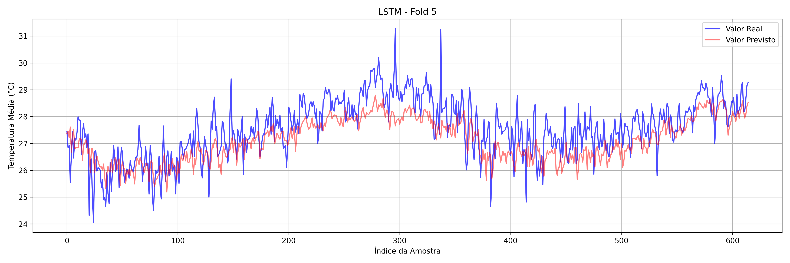
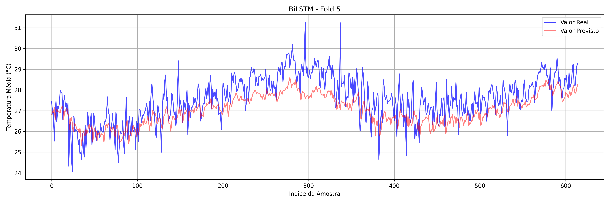
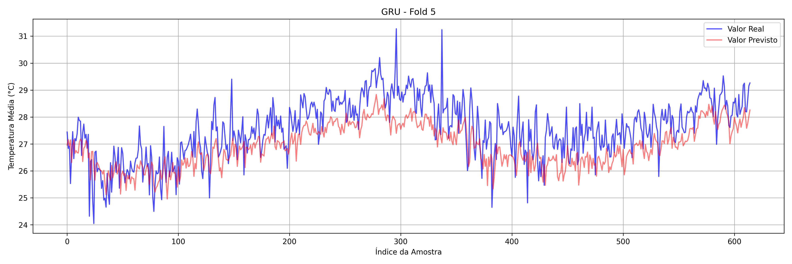

[](https://github.com/GabrieleAraujo/LSTM-BiLSTM-GRU-Comparison-/issues)
[](https://github.com/GabrieleAraujo/LSTM-BiLSTM-GRU-Comparison-/pulls)
[](https://github.com/GabrieleAraujo/LSTM-BiLSTM-GRU-Comparison-)

# Comparative Analysis of LSTM, BiLSTM, and GRU for Meteorological Time Series Forecasting

This repository contains the code, data, and results for the study **"Análise Comparativa de Modelos LSTM, BiLSTM e GRU na Previsão de Dados Meteorológicos"**. The work compares three RNN architectures such as LSTM, BiLSTM, and GRU, in forecasting daily average temperature using meteorological time series from Belém, Pará, Brazil.

## Overview

Recurrent neural networks have shown promise in modeling sequential data. However, traditional RNNs suffer from vanishing gradients in long-term dependencies. To overcome these limitations, this study compares the performance of advanced RNN architectures such as **LSTM**, **BiLSTM**, and **GRU**, in time series forecasting tasks using the following metrics:
- MAE (Mean Absolute Error)
- MSE (Mean Squared Error)
- RMSE (Root Mean Squared Error)
- R² (Coefficient of Determination)

**Key finding**:  
LSTM presented the best results in most metrics, though all models performed competitively.

## Repository Structure

```bash
LSTM-BiLSTM-GRU-Comparison-/
├── data/                    # Meteorological dataset (normalized and raw)
│   └── BrazilWeather.csv
├── figures/                 # Prediction plots for each model
│   ├── LSTM_Fold_5_predictions.png
│   ├── BiLSTM_Fold_5_predictions.png
│   └── GRU_Fold_5_predictions.png
├── results/                 # Output metrics from cross-validation
│   └── metrics_summary.csv
├── notebooks/               # Jupyter notebooks used for training and analysis
│   ├── LSTM_Model.ipynb
│   ├── BiLSTM_Model.ipynb
│   └── GRU_Model.ipynb
├── utils/                   # Preprocessing and helper scripts
│   └── preprocessing.py
├── README.md
└── requirements.txt         # Dependencies
```

## Dataset

The meteorological dataset was obtained from INMET (station A201 - Belém, Pará), spanning from January 1, 2014 to October 31, 2024. Variables include:
- Mean, max, and min temperature
- Relative humidity
- Daily precipitation

Missing values were filled using linear interpolation. All data was normalized with `MinMaxScaler` and segmented into sequences of 30 time steps for model input.

## Model Architectures

| Model   | Layers                   | Neurons         | Activation         |
|---------|--------------------------|------------------|--------------------|
| LSTM    | 2 LSTM + Dense           | 100, 50, 25, 1   | ReLU, Linear       |
| BiLSTM  | 2 BiLSTM + Dense         | 100, 50, 25, 1   | ReLU, Linear       |
| GRU     | 2 GRU + Dense            | 100, 50, 25, 1   | ReLU, Linear       |

All models were trained with:
- Optimizer: Adam (lr = 0.005)
- Epochs: up to 150
- Batch size: 64
- Early stopping (patience = 10)
- Dropout: 20%

## Results

### Average performance across 5-fold CV:

| Model  | MAE              | MSE              | RMSE             | R²                |
|--------|------------------|------------------|------------------|-------------------|
| LSTM   | **0.0299 ± 0.0014** | **0.0016 ± 0.0003** | **0.0399 ± 0.0037** | **0.3426 ± 0.0720** |
| BiLSTM | 0.0304 ± 0.0030  | 0.0017 ± 0.0004  | 0.0405 ± 0.0045  | 0.3190 ± 0.1078   |
| GRU    | 0.0304 ± 0.0038  | 0.0016 ± 0.0004  | 0.0402 ± 0.0048  | 0.3335 ± 0.0835   |

### Visual Comparison

- **LSTM**:  
  
  
- **BiLSTM**:  
  

- **GRU**:  
  

While all models capture the general seasonal patterns, they show limitations in predicting extreme events.

## How to Run

1. Clone the repository:
   ```bash
   git clone https://github.com/GabrieleAraujo/LSTM-BiLSTM-GRU-Comparison-.git
   cd LSTM-BiLSTM-GRU-Comparison-
   ```
2. Run notebooks in each model's ``train_rnns.ipynb``.

## License
This project is licensed under the MIT License.
